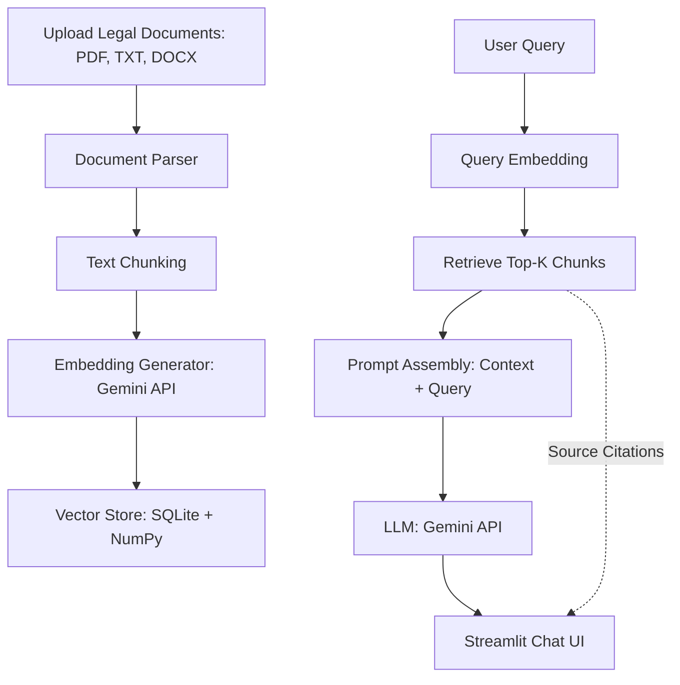

# AI-Powered Legal Document Assistant (LexiRAG)

An intelligent, secure, and fast Retrieval-Augmented Generation (RAG) system built to parse legal documents (PDF, DOCX, TXT), index them into a high-performance local SQLite + NumPy vector database, and answer user queries with precise source and page citations.

## Features

- **Document Ingestion & Chunking:** Parses `.pdf` (page-by-page), `.docx` (section-by-section), and `.txt` (paragraph-by-paragraph) using character-limit sliding windows that respect sentence boundaries.
- **Local SQLite + NumPy Vector DB:** Zero-configuration local database. Embeddings are stored as binary buffers in SQLite and compared in-memory using NumPy cosine similarity for lightning-fast performance on Windows without compiling C++ libraries.
- **RAG QA Engine:** Utilizes the official, modern `google-genai` SDK and Google's Gemini models (`gemini-2.5-flash` or `gemini-2.5-pro`) to reason over legal documents and answer questions.
- **Precise Citation Tracking:** Highlights exactly where in the source document the facts were retrieved (page numbers for PDFs, section indices for DOCX/TXT) alongside match scores.
- **Premium Streamlit UI:** Fully responsive dashboard featuring:
  - Collapsible source citations and matching preview cards.
  - Complete document inventory with metadata and single-file deletion capabilities.
  - Interactive corpus analytics charts (text volumes, format distributions, chunk divisions).
  - Configurable RAG parameters (similarity thresholds, temperatures, chunk sizing, etc.).

---

## Architecture Overview



---

## Installation & Setup

### Prerequisites
- Python 3.10+ (Native Windows installation is recommended)
- A Google Gemini API Key (obtained from [Google AI Studio](https://aistudio.google.com/))

### Setup & Launch Instructions

1. **Clone the Repository:**
   Open PowerShell or command line and run:
   ```powershell
   git clone https://github.com/Gokulraj-max/AI-Powered-Legal-Document-Assistant.git
   cd AI-Powered-Legal-Document-Assistant
   ```

2. **Create a Virtual Environment:**
   ```powershell
   python -m venv venv
   ```

3. **Install Dependencies:**
   Ensure pip is up-to-date and install the required libraries:
   ```powershell
   # Upgrade pip inside the virtual environment
   .\venv\Scripts\python.exe -m pip install --upgrade pip

   # Install requirements
   .\venv\Scripts\pip.exe install -r requirements.txt
   ```

4. **Run the Streamlit Application:**
   ```powershell
   .\venv\Scripts\streamlit.exe run app.py
   ```

5. **Access the UI:**
   Open your browser and navigate to `http://localhost:8501`.

---

## How to Use

1. **Configure API Key:** Input your Gemini API Key in the left sidebar.
2. **Upload Legal Documents:** Go to the **Document Library** tab, drag and drop your files, and click **Process & Ingest Uploaded Documents**.
3. **Chat:** Return to the **Chat Assistant** tab and ask questions about your documents (e.g. *"What is the governing law of the agreement?"* or *"What are the notice requirements for termination?"*).
4. **Inspect Sources:** Expand the **Citations & Retrieved Sources** box beneath any assistant reply to verify the exact sentences and pages the AI used to answer your question.
5. **Analytics:** View the **Visual Analytics** tab to see metrics on your document corpus.
